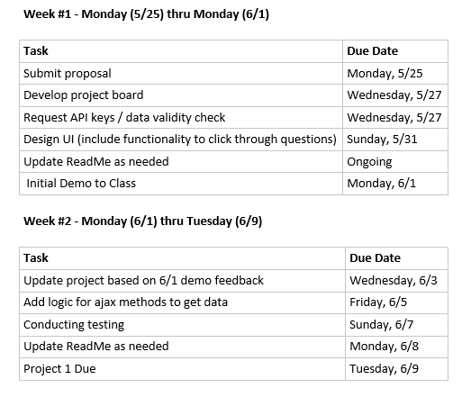

# Group 4 Project 1

## Project Title

A Better Movie Streaming Experience

## Project Description

Have you ever found yourself spending too much time searching for just the right movie or show over all your entertainment streaming apps (Netflix, Hulu, HBO, Amazon Prime, etc.)? If your answer is yes, this application that we are proposing will make your movie streaming experience better!!

The goal of this project would be to develop a responsive application the would allow users to search through the content of their various movie streaming apps to help them find the right movie or show to watch according to the following selection criteria:

- Movie streaming app (i.e. Netflix, Hulu, Amazon Prime, etc.)
- Genre
- Movie vs show series
- Assigned movie rating (G, PG, PG-13, R)
- NICE TO HAVE: Random streaming recommendation (allows app to make random movie recommendation for use)

## User Story

```
AS a fan of movie streaming
I WANT to be able to be able to search all my movie streaming apps
SO THAT I can quickly find the best movie or show to watch

```

## Application

### Screenshot of Draft Homepage

This is the screenshot of our initial version of the homepage.


### Wireframe

This is the draft wireframe for our project app.


## APIs to be Used

All API links provided below were listed on the RapidAPI.com website provided to the class via Slack. Below is an initial list of the APIs we plan to use in this project. The API sources may be modified throughout the duration of the project, depending on validity of the data accessible via each API source.

### APIs for Streaming Apps

- Netflix API - [https://rapidapi.com/rasiqueira/api/netflix-unofficial/details](https://rapidapi.com/rasiqueira/api/netflix-unofficial/details)
- Hulu API - [https://rapidapi.com/Streamzui/api/hulu1/details](https://rapidapi.com/Streamzui/api/hulu1/details)
- Amazon Prime Video API - [https://rapidapi.com/Streamzui/api/streamzui-amazon-prime-video-search](https://rapidapi.com/Streamzui/api/streamzui-amazon-prime-video-search)
- Rotten Tomatoes API - [https://rapidapi.com/blog/directory/rotten-tomatoes/](https://rapidapi.com/blog/directory/rotten-tomatoes/)
- IMDB API - [https://rapidapi.com/hmerritt/api/imdb-internet-movie-database-unofficial](https://rapidapi.com/hmerritt/api/imdb-internet-movie-database-unofficial)

## Group 4 Members

- [Juliet Goldstein](https://github.com/julietg19)
- [Krystal Duran](https://github.com/KEDuran)
- [Vandolph Baptiste](https://github.com/vandolph44)

## Rough Breakdown of Tasks

Here is our tentative project timeline.


