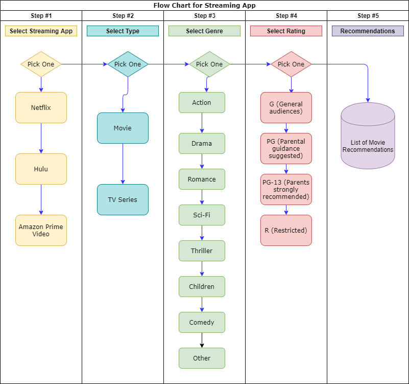

# Group 4 - Project 1

## Project Title

A Better Streaming Experience

### Value Added Proposal

The goal for this project was to develop a responsive web application, with a mobile-first UI, that the would allow users to search through the content of their various movie streaming applications to help them find the right movie or show to watch according to the following selection criteria:

- Movie streaming applications
  - For the scope of this project, the team focuses on targeting Netflix, Amazon Prime, and Hulu as our three streaming applications.
- Genre
- Movie vs show series
- Assigned movie rating (G, PG, PG-13, R)

## GitHub Project Repo and GitHub Pages Link

Here are the links to the team's GitHub Project Repo and GitHub pages link for our web application.

- Link to GitHub Project Repo - [https://github.com/Group4project1/project1](https://github.com/Group4project1/project1)
- Link to GitHub Pages for Web App - [https://group4project1.github.io/project1/](https://group4project1.github.io/project1/)

## Group 4 Members

- [Juliet Goldstein](https://github.com/julietg19)
- [Krystal Duran](https://github.com/KEDuran)
- [Vandolph Baptiste](https://github.com/vandolph44)

## User Story

```
AS a fan of movie streaming
I WANT to be able to be able to search through my movie streaming applications
SO THAT I can quickly find the best movie or show to watch

```

## Acceptance Criteria

```
GIVEN a movie / TV series web application
WHEN I select my preferred streaming application and click Next
THEN I am presented with a question that requires I select either a movie or TV series
WHEN I select whether I prefer a movie or TV series and click Next
THEN I am presented with a question that requires I select my prefered genre
WHEN I select my preferred genre and click Next
THEN I am presented with a question that requires I select my prefered movie rating (G, PG, PG-13, R)
WHEN I selecy my preferred rating and click Recommendations
THEN I am presented with either:
    * (1) a list of recommended movies based on my selection criteria  -or-
    * (2) an alternative list of movies that are showing in theaters if no API data is avaliable
```

## Tools Used for Development

The list below includes all the technical tools we used to develop this web application:

- HTML
- JavaScript
- Materialize CSS
- Post Man
- Draw.io
- Visual Studio Code
- Two third-party API sources (listed in the following section)

## Wireframe

This is the homepage wireframe we designed at the beginning of our project to determine the layout of our application. Overall, our final homepage layout mirrors the wireframe's design.


## Functionality via Flow Chart

This flowchart briefly outlines the core functionality of our better streaming web application.



## APIs Used for the Project

It was a challenge for our team to find a completely free (i.e. no quota) API that had the movie/app streaming data we desired. Nevertheless, we were able to find and use the two API's listed below to design our web application. Please reference the "Lessons Learned" section below for a better understanding of the API limitations our team faced and how we pivoted to meet out project's MVP requirements.

### APIs for Streaming Apps

- IMDb API - [https://rapidapi.com/apidojo/api/imdb8](https://rapidapi.com/apidojo/api/imdb8)
  - This API was used to populate movies data based on user selection criteria because (in limited scenarios) this API had the data that showed where movies / TV series were streaming.
- The Movie Database API - [https://developers.themoviedb.org/3/getting-started/introduction](https://developers.themoviedb.org/3/getting-started/introduction)
  - This API was used to populate the alternative list of movies current showing in theaters for when the application was unable to pull content matches for the users selections.

### Lessons Learned

The team wanted to take a moment to document the lessons learned we experience throughout this project. We think it is important to share our experiences with others in hopes of giving the next streaming application the opportunity to be more robust.

#### What is feasible in two weeks?

- **Stick with MVP** - As new developers, understanding what is feasible within a two week timeframe is a challenge. Throughout the process, we had various wodnerful ideas we wantd to develop; however, the realities of a two-week timeline, limited resources, and meeting MVP requirements quickly taught us that it's better to develop a quality MVP product than a flashy (but disfunctional) application.

#### API Struggles

- **Free APIs** - Finding two API's that met our data needs was difficult. Even though we were able to find and apply two different APIs sources as required for this project, we learned that a quality, unlimited movies/TV series API required payment and official vetting from associated rating and/or production companies. In order to make our project work within the allocated two-week timeframe, we had to settle for free API's with limited quotas. This resulted in our team having to regularly monitor and rotate API keys into the code.

- **Data Discrepancy** - While developing our application, we learned an application us only as sucecessful as the data being pulled. We encountered many sitautions where the free APIs that we used did not always have complete or consistent data items. For example, we regularly found that streaming application information, ratings, and type were not consistently provided. With missing data, we found that applying the user's selection criteria further restricted the movie / TV series output within the application we developed.

## Application

In this section, sample screenshots are included below to demonstrate the style and output capabilities of this web application. **_Please note that any movies listed in the screenshots below are subject to change based on the availability of the data from the utilized API source(s)._**

### Screenshot of Homepage

This is the screenshot of our web application's homepage via Pixel 2 screen size tested in the Google Inspect window. As specified in the instructions, the web application was designed to have mobile-first UI; however, the web app can also be successfully viewed from a desktop screen as well.


### Screenshot of Output based on User Selected Criteria

In line with the challenges outlined in the previous "Lessons Learned" section, the team wanted to provide a screenshot that demonstrates that the web application does have the capabilities to generate a movie based on user selection criteria. The [IMDb API from RapidAPI.com](https://rapidapi.com/apidojo/api/imdb8) was used to pull data based on the user's criteria. However, only movies with data that identically matched the users selection criteria were successfully pulled from the API. This resulted in a limited amount of scenarios where movies populated to match the user's selected criteria - as scene is the screenshot below.

The selection criteria used to populate this movie ia listed in the bullets below.

- App - Amazon Prime Video
- Type - Movie
- Genre - Romance
- Rating - PG-13


### Screenshot of Output for Alternative Recommendations

In order to demonstrate the intended functionality and layout of our streaming application, the team decided to include an alternative movie recommendation output which would generate a list of 10 movies that are currently showing in theaters. We used our second API from [themoviedb.org ](https://developers.themoviedb.org/3/getting-started/introduction) to generate this alternative movie recommendation list that will pop-up if the user's criteria did not populate any movie/TV series listings from the [IMDb API from RapidAPI.com](https://rapidapi.com/apidojo/api/imdb8).


## Project Timeline

Here is our team's project timeline. The due dates included in the table below assisted the team's planning efforts to stay organize and on task for the duration of the project.


