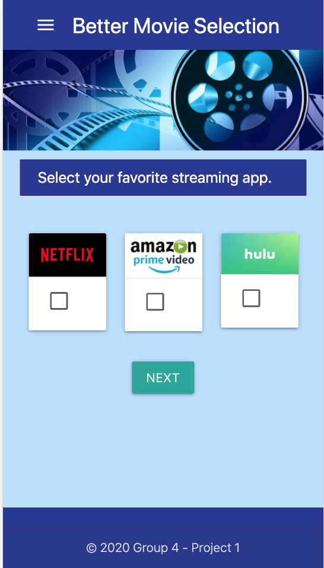

# Group 4 - Project 1

## Project Title

A Better Streaming Experience

## Project Description

Have you ever found yourself spending too much time searching for just the right movie or show over all your entertainment streaming apps (Netflix, Hulu, HBO, Amazon Prime, etc.)? If your answer is yes, this application that we are proposing will make your movie streaming experience better!!

### Added-Value Purpose

The goal of this project would be to develop a responsive application the would allow users to search through the content of their various movie streaming apps to help them find the right movie or show to watch according to the following selection criteria:

- Movie streaming app (i.e. Netflix, Hulu, Amazon Prime, etc.)
- Genre
- Movie vs show series
- Assigned movie rating (G, PG, PG-13, R)

## Group 4 Members

- [Juliet Goldstein](https://github.com/julietg19)
- [Krystal Duran](https://github.com/KEDuran)
- [Vandolph Baptiste](https://github.com/vandolph44)

## User Story

```
AS a fan of movie streaming
I WANT to be able to be able to search all my movie streaming apps
SO THAT I can quickly find the best movie or show to watch

```

## Acceptance Criteria

```
GIVEN a movie web application
WHEN I select my preferred streaming application and click Next
THEN I am presented with a question that requires I select either a movie or TV series
WHEN I select whether I prefer a movie or TV series and click Next
THEN I am presented with a question that requires I select my prefered genre
WHEN I select my preferred genre and click Next
THEN I am presented with a question that requires I select my prefered movie rating (G, PG, PG-13, R)
WHEN I selecy my preferred rating and click Recommendations
THEN I am presented with either:
    * (1) a list of recommended movies if my selected criteria matches content stored in the API  -or-
    * (2) and alternative list of movies showing in theaters if no API data is avaliable
```

## Tools Used for Development

The list below includes all the technical tools used to develop this web application:

- HTML
- JavaScript
- Materialize CSS
- Post Man
- Draw.io
- Visual Studio Code

## Wireframe

This is the homepage wireframe we designed at the beginning of our project to determine the layout of our app. Overall, our final homepage layout mirrors the wireframe's design.


## APIs Used for the Project

It was a challenge for our team to find a completely free (i.e. no quota) API that had the movie/app streaming data. Nevertheless, we were able to find and use the two API's listed below to design our web app. Please reference the "Lessons Learned" section below for a better understanding of the API limitations our team faced and how we pivoted to meet out project's MVP requirements.

### APIs for Streaming Apps

- IMDb API - [https://rapidapi.com/apidojo/api/imdb8](https://rapidapi.com/apidojo/api/imdb8)
- The Movie Database API - [https://developers.themoviedb.org/3/getting-started/introduction](https://developers.themoviedb.org/3/getting-started/introduction)

### Lessons Learned

ADD CONTENT HERE

## Application

In this section, sample screenshots are included below to demonstrate the style and output capabilities of this web app. **_Please note that any movies listed in the screenshots below are subject to change based on the availability of the data from the team's utilized API sources._**

### Screenshot of Homepage

This is the screenshot of our web app's homepage via Pixel 2 screen size test shot. As specified in the instructions, the web app was designed to have mobile-first UI; however, the web app can also be successfully viewed from a desktop screen as well.



### Screenshot of Output based on User Selected Criteria

In line with the challenges outlined in the "Lessons Learned" section, the team wanted to provide a screenshot that demonstrates the web app does have the capabilities to generate a movie based on user selection criteria. The [IMDb API from RapidAPI.com](https://rapidapi.com/apidojo/api/imdb8) was used to pull data based on the user's criteria. However, only movies with data that identically matched the users selection criteria were successfully pulled from the API. This resulted in a limited amount of movies populating as scene is the screenshot below.

The selection criteria used to populate this movie are listed in the bullets below.

- App - Amazon Prime Video
- Type - Movie
- Genre - Romance
- Rating - PG-13


### Screenshot of Output for Alternative Recommendations

In order to demonstrate the intended functionality and layout of our streaming app, the team decided to include an alternative movie recommendation output which would generate a list of 10 movies that are currently showing in theaters. We used a second API from [themoviedb.org ](https://developers.themoviedb.org/3/getting-started/introduction) to generate this alternative movie recommendation for the user if the user's criteria did not populate any movie/TV series listings from the [IMDb API from RapidAPI.com](https://rapidapi.com/apidojo/api/imdb8).


## Project Timeline

Here is our team's project timeline. The due dates listed in the table below assisted in the team's planning efforts to stay organized throughout the project.


